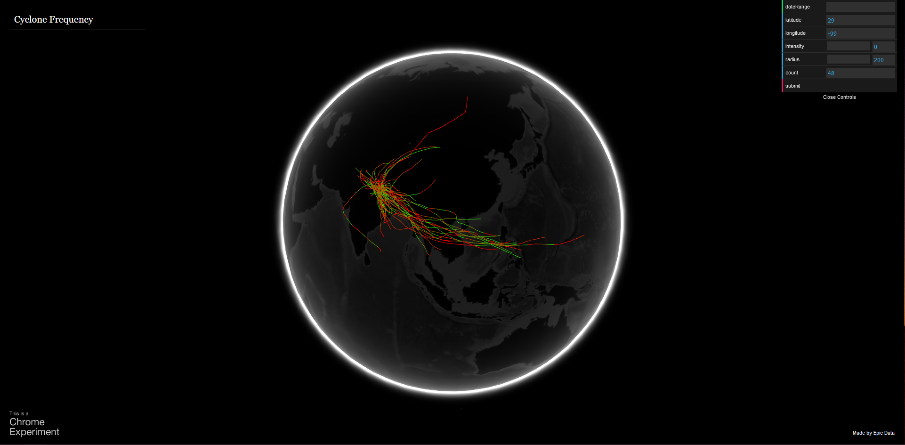
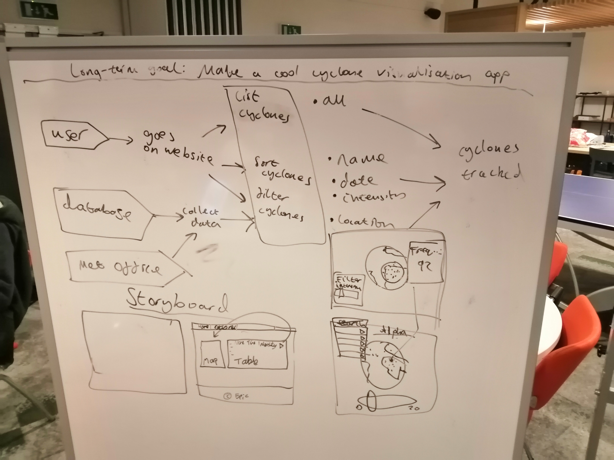

# Met Office 2020 Hackathon
Develop a program for visualising tropical cyclone locations and their paths.

## Images



Whiteboarding out the vision for our problem, the user's flow through the problem and a draft storyboard of our solution.


Extending out our storyboard and breaking down the technical overview of our problem so we can make decisions on technologies delegate tasks to one another. Here we go through the full story of both the user and 'the computer' as they journey through the problem.

## Project Initiative
Develop a GUI for Tropical Cyclones.

The GUI should be able to:
- Display a table of cyclones.
- Sort this table by attribute.
- Filter this table by attribute.
- See a visualisation of the cyclone passing over a map.

In practice:
- Open the GUI to see a list of cyclones.
- Cyclones can be sorted by name, date or intensity.
- Cyclones can be filtered by countries they entered.
- Play the visualisation.

For example:
- User enters the application.
- User sorts the cyclones by date.
- User filters it down to cyclones in India.
- User can play a visualisation of each cyclone.

## Data to Download
Log-in to AWS and then navigate to:
https://s3.console.aws.amazon.com/s3/buckets/informatics-data/hackathon-jan2020/?region=eu-west-1&tab=overview

Download the files in tropical-cyclone-data.

## Our Application
Step 1: Collect data from Met Office S3 bucket.

Step 2: Process data with Python.

Step 3: Store in database.

Step 4: Web server queries database and displays on website.

Step 5: User uses website: they can modify visualisation parameters and easily request cyclone path visualisations on a globe.

## Tropical Cyclone Spreadsheet
Not available yet.

## csv to JSON import format for visualisation component
```javascript
var data = [
    [
    'seriesA', [ latitude, longitude, magnitude, latitude, longitude, magnitude, ... ]
    ],
    [
    'seriesB', [ latitude, longitude, magnitude, latitude, longitude, magnitude, ... ]
    ]
];
```
